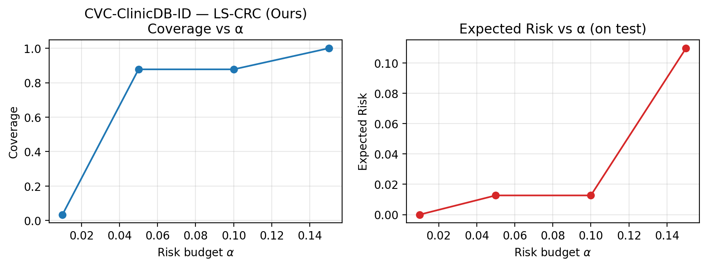

# Gói chèn thẳng vào paper (bảng + figure)

**Nguồn số liệu:** sweep `checkpoints_cvc_adapted`, α = **0.05** (bảng chính); sweep α ∈ {0.01, 0.05, 0.10, 0.15} cho LS-CRC trên CVC in-domain. Chi tiết phân tích: [experiments_and_results.md](../experiments_and_results.md).

---

## Việc cần có trên đĩa trước khi chèn ảnh

1. Đồ thị (đã có nếu bạn chạy xong khối §5.3 trong `guide_improvements_v1.2.md`):
   - `figures/paper/risk_coverage_vs_alpha__cvc__lscrc.png`
   - `figures/paper/risk_coverage_vs_alpha__cvc__lscrc_scatter.png`
2. Ảnh qualitative (chạy nếu chưa có):
   ```bash
   cd ~/Desktop/LS-CRC && source .venv/bin/activate
   mkdir -p figures/qual_cvc_in
   python tools/export_qualitative_figures.py \
     --checkpoint-dir checkpoints_cvc_adapted \
     --encoder-weights imagenet \
     --cal-root data/CVC-ClinicDB \
     --test-root data/CVC-ClinicDB \
     --alpha 0.05 \
     --num-images 4 \
     --out-dir figures/qual_cvc_in \
     --prefix fig_qual_cvc
   ```
3. Copy các file PNG vào thư mục `figures/` của project LaTeX/Overleaf (hoặc giữ đường dẫn tương đối).

---

## Bảng 1 — Kết quả chính (α = 0.05, checkpoint CVC-adapted)

*Localized expected risk* và *coverage* trên tập **test**; calibrate τ trên **cal** cùng scenario. Dice giống nhau giữa các method (cùng backbone).

### Markdown (Word / Google Docs)

| Scenario | Method | Dice ↑ | Coverage | Exp. Risk ↓ |
|----------|--------|--------|----------|-------------|
| Kvasir ID | Plain | 0.819 | 1.000 | 0.118 |
| Kvasir ID | Entropy | 0.819 | 0.947 | 0.071 |
| Kvasir ID | Max-softmax | 0.819 | 0.948 | 0.071 |
| Kvasir ID | **LS-CRC (Ours)** | 0.819 | **0.805** | **0.028** |
| CVC ID | Plain | 0.870 | 1.000 | 0.110 |
| CVC ID | Entropy | 0.870 | 0.925 | 0.027 |
| CVC ID | Max-softmax | 0.870 | 0.921 | 0.025 |
| CVC ID | **LS-CRC (Ours)** | 0.870 | **0.878** | **0.013** |
| Cross Kvasir→CVC | Plain | 0.870 | 1.000 | 0.110 |
| Cross Kvasir→CVC | Entropy | 0.870 | 0.970 | 0.068 |
| Cross Kvasir→CVC | Max-softmax | 0.870 | 0.970 | 0.068 |
| Cross Kvasir→CVC | **LS-CRC (Ours)** | 0.870 | **0.878** | **0.013** |
| Cross CVC→Kvasir | Plain | 0.819 | 1.000 | 0.118 |
| Cross CVC→Kvasir | Entropy | 0.819 | 0.869 | 0.034 |
| Cross CVC→Kvasir | Max-softmax | 0.819 | 0.861 | 0.033 |
| Cross CVC→Kvasir | **LS-CRC (Ours)** | 0.819 | **0.805** | **0.028** |

**Chú thích hàng:** *Kvasir ID* = cal & test Kvasir-SEG; *CVC ID* = cal & test CVC-ClinicDB; *Cross Kvasir→CVC* = cal Kvasir, test CVC; *Cross CVC→Kvasir* = cal CVC, test Kvasir.

### Xem trước ảnh trong repo (Cursor / VS Code)




*(Nếu ảnh không hiện: chưa chạy plot hoặc đường dẫn khác — mở trực tiếp thư mục `figures/paper/`.)*

---

## Bảng 2 — Nhạy cảm α (chỉ LS-CRC, CVC in-domain)

| α | τ* | Coverage | Exp. risk | Ghi chú ngắn |
|---|-----|----------|-----------|----------------|
| 0.01 | 0.999 | 0.034 | ≈0 | Gần không chấp nhận |
| 0.05 | 0.525 | 0.878 | 0.0127 | Điểm vận hành ổn định |
| 0.10 | 0.525 | 0.878 | 0.0127 | Bão hòa lưới τ (giống α=0.05) |
| 0.15 | 0.010 | 1.000 | 0.110 | τ sàn → chấp nhận toàn ảnh |

---

## File LaTeX (booktabs) — copy vào `.tex`

- [table1_main_alpha005.tex](table1_main_alpha005.tex) — Bảng 1  
- [table2_lscrc_sweep_cvc.tex](table2_lscrc_sweep_cvc.tex) — Bảng 2  
- [figure_snippets.tex](figure_snippets.tex) — `\includegraphics` + caption tiếng Anh

---

## Caption gợi ý (tiếng Anh, cho journal)

**Figure A (line plots).** *Effect of risk budget α on mean coverage and mean localized expected risk on the CVC-ClinicDB test set for LS-CRC (ours), with thresholds calibrated on the CVC calibration split. Checkpoint includes domain adaptation on CVC.*

**Figure B (scatter).** *Mean coverage vs. mean localized expected risk for LS-CRC at several α; labels indicate α.*

**Figure C (qualitative).** *Example cases: input, ground truth, prediction overlay, and LS-CRC acceptance map (green) with score map after calibration at α = 0.05.*

---

## Checklist trước khi nộp

- [ ] Điền đúng tên dataset / ethics nếu journal yêu cầu  
- [ ] Thống nhất số chữ số thập phân (ở đây 3 cơ bản)  
- [ ] Kiểm tra ảnh đủ DPI (plot script mặc định 200; qualitative 150 — tăng `--dpi` nếu cần in)  
- [ ] Trong PDF, thay `\includegraphics{...}` bằng đường dẫn file bạn copy vào project LaTeX
