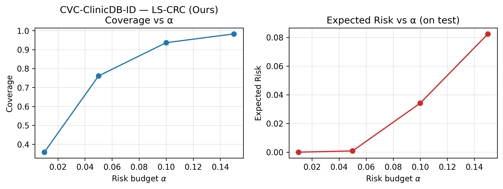
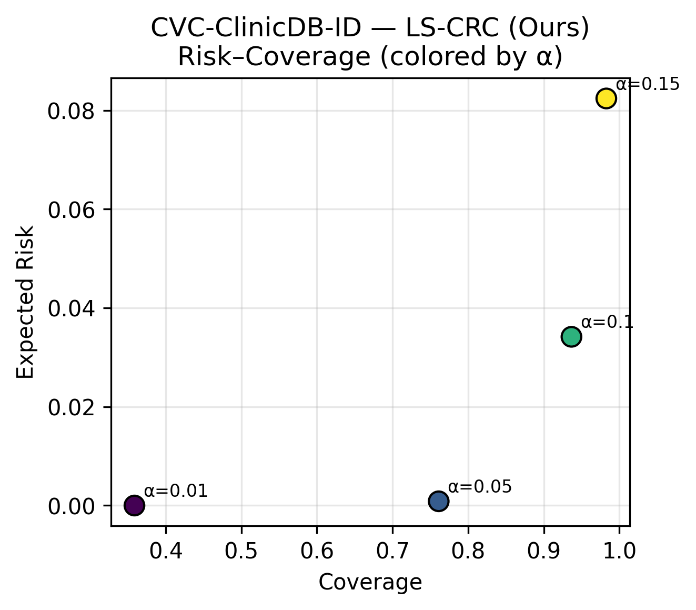
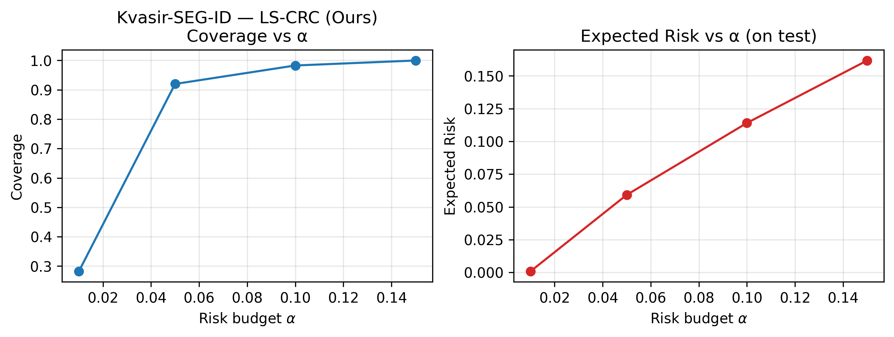
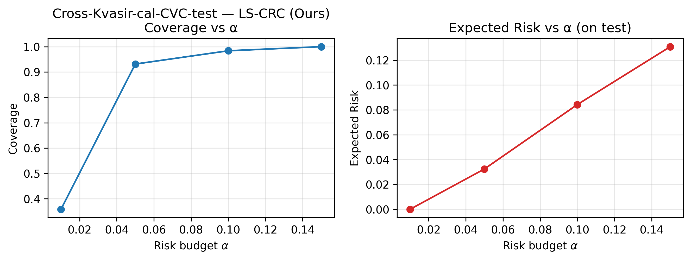
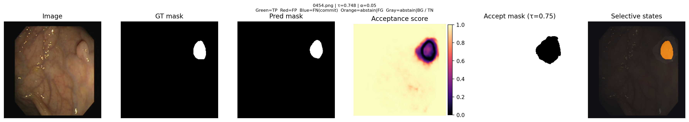
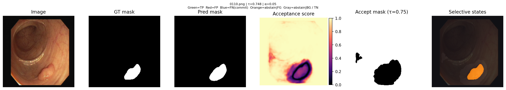
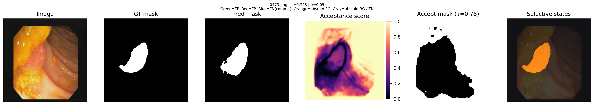

# Learning Structured Abstention for Localized Conformal Risk Control in Segmentation

**Anonymous Authors**

*Submitted to the Fortieth Conference on Neural Information Processing Systems (NeurIPS 2026)*

---

## Abstract

Conformal Risk Control (CRC) provides finite-sample control of expected bounded monotone losses, making it a principled tool for risk-calibrated deployment. In image segmentation, however, standard CRC is fundamentally marginal: it controls average selective error but does not determine where the model should spend its risk budget. In medical segmentation, this limitation is acute because errors concentrate on thin boundaries, small structures, and visually difficult images. We propose **Localized Selective Conformal Risk Control (LS-CRC)**, a framework that combines a learned pixel-wise rejector with split conformal threshold calibration. LS-CRC trains a structured acceptance model using prediction correctness, uncertainty cues, and localized risk surrogates, then calibrates a single acceptance threshold on a held-out calibration set to satisfy a user-specified selective false-negative risk target. Our main theorem shows that LS-CRC inherits the standard marginal CRC guarantee because the calibrated loss remains bounded and monotone in the threshold parameter. We further give a subgroup deviation decomposition clarifying why marginal control need not imply subgroup control, and why a good rejector can reduce this gap in practice. Experiments on Kvasir-SEG and CVC-ClinicDB show that LS-CRC improves the risk–coverage frontier over scalar uncertainty thresholding and spatially weighted conformal baselines, achieving higher accepted-pixel coverage at comparable test risk and materially improving worst-image risk on the adapted domain. These results suggest that learned spatial abstention can make CRC substantially more efficient without relaxing its finite-sample calibration principle.

---

## 1. Introduction

Reliable deployment of segmentation systems requires more than high mean Dice or IoU. In clinical segmentation, and especially in colonoscopy polyp delineation, failures are spatially concentrated: boundaries are ambiguous, small lesions are easily missed, and a minority of hard images can dominate operational error. A model that predicts everywhere may achieve strong average overlap while still making precisely the localized mistakes that matter most in downstream use.

Conformal methods offer an attractive route to statistically disciplined deployment. In particular, Conformal Risk Control (CRC) calibrates a one-dimensional decision parameter on a held-out exchangeable calibration set so that the resulting predictor controls the expected value of a bounded monotone loss. This framework is broad enough to cover false-negative risk, weighted miss losses, and other structured deployment objectives. But CRC is only a calibration mechanism over a fixed family of predictors: it decides **how much** risk can be spent, not **where** in the image that risk should be allocated.

This distinction is central in dense prediction. Standard scalar acceptance rules, such as thresholding entropy or max-softmax, apply a coarse uncertainty ranking that often ignores spatial geometry. In segmentation, risky pixels are not randomly scattered. They cluster near object contours, textured interfaces, specular artifacts, and domain-shifted regions. If the score family presented to CRC does not reflect this structure, calibration may be statistically valid yet operationally inefficient, yielding either overly conservative abstention or poor concentration of accepted errors.

We address this limitation by learning a **structured abstention policy** before conformal calibration. Our framework, **Localized Selective Conformal Risk Control (LS-CRC)**, augments a segmentation backbone with a pixel-wise rejector that predicts an acceptance score map. The rejector is trained to identify which spatial locations are safe to commit, using decoder features, uncertainty signals, prediction correctness, and a differentiable surrogate of localized selective risk. At deployment time, a single threshold on the acceptance map is chosen by split conformal calibration on a held-out calibration set. This preserves the essential CRC logic: the model family is fixed before calibration, and calibration selects the most permissive threshold whose empirical risk satisfies the target.

The key technical step is to define a segmentation-specific selective loss that is compatible with CRC. We introduce a **localized selective miss risk** that penalizes accepted false negatives, optionally reweighted toward clinically important boundary bands, while keeping the denominator independent of the threshold parameter. This produces a bounded loss that is monotone in the acceptance threshold, so the standard CRC machinery applies directly.

Our position is deliberately precise. We do **not** claim distribution-free conditional selective guarantees at the image, subgroup, or pixel level. Such guarantees are impossible in broad generality without additional assumptions. Instead, we show that LS-CRC inherits the usual marginal CRC guarantee and empirically reduces tail concentration by learning where abstention should occur. In other words, our contribution is not a stronger form of conformal validity, but a better calibrated family on which CRC can operate.

### Contributions

1. **Framework.** We propose LS-CRC, a segmentation framework that combines a learned pixel-wise rejector with split conformal risk calibration to control localized selective false-negative risk.
2. **Loss design.** We define a boundary-aware localized selective miss loss whose monotonicity makes it compatible with CRC threshold calibration.
3. **Theory.** We prove that LS-CRC inherits the marginal CRC guarantee under standard assumptions, and provide a subgroup deviation decomposition clarifying why subgroup risk can deviate from the marginal target despite valid calibration.
4. **Empirics.** On Kvasir-SEG and CVC-ClinicDB, LS-CRC improves accepted-pixel coverage at comparable risk budgets and shows the strongest worst-image risk on the adapted target domain.

---

## 2. Related Work

### Conformal prediction and conformal risk control

Conformal prediction provides distribution-free marginal guarantees under exchangeability, traditionally expressed as prediction-set coverage. Conformal Risk Control extends this logic to bounded monotone loss functions, allowing calibration of selective classifiers and structured predictors against user-defined risk targets. The critical requirement is a one-dimensional family of predictors indexed by a parameter for which the loss is monotone.

Our method builds directly on this setup. We do not alter the calibration theorem. Rather, we learn a richer score family so that the CRC-selected threshold can achieve better coverage for the same risk target.

### Segmentation uncertainty and selective prediction

Segmentation reliability has been studied through entropy maps, confidence margins, ensembling, test-time dropout, and selective prediction. These methods establish that abstaining on uncertain regions can improve retained accuracy, but they generally lack finite-sample guarantees on the final deployed rule. In practice, scalar uncertainty thresholds also ignore the structured geometry of segmentation errors.

LS-CRC differs in two ways: first, it trains a spatially structured acceptor rather than relying on a fixed scalar uncertainty score; second, the final deployment threshold is selected by held-out conformal calibration rather than by validation tuning.

### Tail reliability and subgroup robustness

Mean risk can hide clinically important heterogeneity. Segmentation errors are often driven by small objects, complex boundaries, and difficult acquisition conditions. This has motivated interest in worst-group and tail-aware evaluation. Our method is aligned with this perspective, but the theoretical guarantee remains marginal. Subgroup and tail behavior are therefore treated as empirical properties to be measured, not as distribution-free guarantees to be claimed.

### Positioning

Relative to standard CRC, LS-CRC contributes a learned structured abstention policy. Relative to learned selective segmentation, LS-CRC contributes finite-sample marginal risk calibration. Relative to purely uncertainty-thresholded baselines, LS-CRC aims to spend the same calibrated risk budget more efficiently by abstaining where errors actually concentrate.

---

## 3. Problem Setup

We consider binary image segmentation. Let \((X, Y) \sim P\), where \(X \in \mathcal{X}\) is an image and \(Y \in \{0,1\}^{H \times W}\) is the ground-truth foreground mask. We observe an exchangeable dataset split into disjoint subsets:

\[
\mathcal{D}_{\mathrm{train}},\; \mathcal{D}_{\mathrm{val}},\; \mathcal{D}_{\mathrm{cal}},\; \mathcal{D}_{\mathrm{test}}.
\]

The calibration set is reserved strictly for threshold calibration and is not used for training or hyperparameter selection.

A segmentation backbone \(f_\theta\) outputs a foreground probability map
\[
p_\theta(x) \in [0,1]^{H \times W},
\]
with hard prediction
\[
\hat y_u(x)=\mathbf{1}\{p_\theta(x)_u \ge 0.5\}.
\]

We introduce a rejector head \(g_\phi\) that outputs a pixel-wise acceptance score map
\[
s_\phi(x) \in [0,1]^{H \times W}.
\]
Given threshold \(\tau \in [0,1]\), the acceptance indicator is
\[
A_u(x;\tau)=\mathbf{1}\{s_\phi(x)_u \ge \tau\}.
\]
The deployed selective segmentation is
\[
\tilde y_u(x;\tau)=
\begin{cases}
\hat y_u(x), & A_u(x;\tau)=1,\\
\bot, & A_u(x;\tau)=0,
\end{cases}
\]
where \(\bot\) denotes abstention.

### Coverage

We define **accepted-pixel coverage** as
\[
C(x;\tau)=\frac{1}{HW}\sum_u A_u(x;\tau),
\qquad
C(\tau)=\mathbb{E}[C(X;\tau)].
\]
In experiments we also report accepted-foreground coverage, but the primary optimization objective uses accepted-pixel coverage for simplicity and comparability.

---

## 4. Localized Selective Risk

The loss used for calibration must reflect deployment semantics while remaining CRC-compatible. We focus on false-negative errors among accepted pixels, since missed foreground regions are often the clinically salient failure mode in polyp segmentation.

Let \(w(x,y)_u \ge 0\) be a spatial weight map, possibly emphasizing boundary pixels. We define the **localized selective miss risk** as

\[
L_{\mathrm{loc}}(x,y;\tau)
=
\frac{\sum_u w_u(x,y)\,\mathbf{1}\{y_u=1\}\,A_u(x;\tau)\,\mathbf{1}\{\hat y_u(x)=0\}}
{\sum_u w_u(x,y)\,\mathbf{1}\{y_u=1\}+\varepsilon}.
\]

This loss has three important properties.

**First**, only committed false negatives are penalized. If the model abstains on a risky foreground pixel, the system is interpreted as deferring that location rather than making an unqualified error.

**Second**, the weight map localizes the notion of risk. In our main experiments we use boundary-aware weights
\[
w_u = 1 + \lambda_b\,\mathbf{1}\{u \in \mathcal{B}(y)\},
\]
where \(\mathcal{B}(y)\) is a morphological boundary band around the foreground mask.

**Third**, and most important for CRC, the denominator is independent of \(\tau\). As \(\tau\) increases, the accepted set can only shrink, so the numerator is nonincreasing in \(\tau\). Therefore \(L_{\mathrm{loc}}(x,y;\tau)\) is monotone nonincreasing in \(\tau\).

This monotonicity is exactly what allows split CRC to calibrate the threshold.

---

## 5. Method

LS-CRC has three stages: segmentation training, rejector training, and threshold calibration.

### 5.1 Stage I: Segmentation backbone

We first train a segmentation backbone \(f_\theta\) on \(\mathcal{D}_{\mathrm{train}}\) using a standard supervised segmentation loss
\[
\mathcal{L}_{\mathrm{seg}} = \lambda_{\mathrm{bce}}\mathcal{L}_{\mathrm{BCE}} + \lambda_{\mathrm{dice}}\mathcal{L}_{\mathrm{Dice}}.
\]
Hyperparameters are selected on \(\mathcal{D}_{\mathrm{val}}\). After this stage, the backbone may either be frozen or lightly fine-tuned during rejector training depending on the experiment.

### 5.2 Stage II: Structured rejector

The rejector head receives a feature tensor
\[
\psi(x)=\big[h_\theta(x),\; p_\theta(x),\; e_\theta(x),\; m_\theta(x)\big],
\]
where \(h_\theta(x)\) denotes an intermediate decoder feature map, \(e_\theta(x)\) is per-pixel predictive entropy, and \(m_\theta(x)\) is the confidence margin. A shallow convolutional head maps these features to the acceptance score map
\[
s_\phi(x)=g_\phi(\psi(x)).
\]

#### Pseudo-labels for acceptance

Because supervision for abstention is unavailable, we construct pseudo-labels using correctness and uncertainty.

For each pixel \(u\), we assign:
- **safe** if the segmentation prediction is correct, uncertainty is low, and the pixel lies away from the boundary band;
- **unsafe** if the prediction is incorrect, uncertainty is high, or the pixel lies in a risky boundary zone;
- **ignore** otherwise.

Formally, we define a masked pseudo-label map \(r^*_u \in \{0,1,-1\}\), where \(-1\) indicates ignored pixels.

#### Rejector objective

The rejector is trained with a combination of classification, smoothness, and localized-risk surrogates:
\[
\mathcal{L}_{\mathrm{rej-total}}
=
\lambda_1 \mathcal{L}_{\mathrm{rej}}
+
\lambda_2 \mathcal{L}_{\mathrm{smooth}}
+
\lambda_3 \mathcal{L}_{\mathrm{loc-sur}}.
\]

Here:
- \(\mathcal{L}_{\mathrm{rej}}\) is masked binary cross-entropy on pseudo-labels;
- \(\mathcal{L}_{\mathrm{smooth}}\) is a total variation penalty encouraging spatial coherence in the score map;
- \(\mathcal{L}_{\mathrm{loc-sur}}\) penalizes high acceptance on pixels likely to become false negatives under the current predictor.

When joint fine-tuning is enabled, the full objective becomes
\[
\mathcal{L}_{\mathrm{joint}} = \mathcal{L}_{\mathrm{seg}} + \mathcal{L}_{\mathrm{rej-total}}.
\]

### 5.3 Stage III: Split conformal threshold calibration

After training, \((\theta,\phi)\) are fixed. We define a finite threshold grid
\[
\mathcal{T} = \{\tau_1,\dots,\tau_M\} \subset [0,1].
\]
For each threshold \(\tau\), we compute empirical calibration risk and empirical calibration coverage:
\[
\widehat R_{\mathrm{cal}}(\tau)=\frac{1}{n_{\mathrm{cal}}}\sum_{(x_i,y_i)\in\mathcal{D}_{\mathrm{cal}}}L_{\mathrm{loc}}(x_i,y_i;\tau),
\]
\[
\widehat C_{\mathrm{cal}}(\tau)=\frac{1}{n_{\mathrm{cal}}}\sum_{(x_i,y_i)\in\mathcal{D}_{\mathrm{cal}}}C(x_i;\tau).
\]

Given target risk level \(\alpha\), we select the most permissive threshold satisfying the calibration constraint:
\[
\tau^*(\alpha)
=
\arg\max_{\tau\in\mathcal{T}}
\widehat C_{\mathrm{cal}}(\tau)
\quad
\text{s.t.}
\quad
\widehat R_{\mathrm{cal}}(\tau) \le \alpha_{n},
\]
where \(\alpha_n\) is the finite-sample corrected target induced by the CRC theorem. Ties are broken in favor of the lower threshold if multiple values give identical coverage.

### Algorithm 1: LS-CRC

**Input:** training set \(\mathcal{D}_{\mathrm{train}}\), validation set \(\mathcal{D}_{\mathrm{val}}\), calibration set \(\mathcal{D}_{\mathrm{cal}}\), test set \(\mathcal{D}_{\mathrm{test}}\), target risk \(\alpha\), threshold grid \(\mathcal{T}\).

1. Train segmentation backbone \(f_\theta\) on \(\mathcal{D}_{\mathrm{train}}\), select hyperparameters on \(\mathcal{D}_{\mathrm{val}}\).
2. Construct rejector features and pseudo-labels using predictions of \(f_\theta\).
3. Train rejector \(g_\phi\) on \(\mathcal{D}_{\mathrm{train}}\), tuning all hyperparameters on \(\mathcal{D}_{\mathrm{val}}\) only.
4. Freeze \((\theta,\phi)\).
5. For each \(\tau\in\mathcal{T}\), compute \(\widehat R_{\mathrm{cal}}(\tau)\) and \(\widehat C_{\mathrm{cal}}(\tau)\) on \(\mathcal{D}_{\mathrm{cal}}\).
6. Select \(\tau^*(\alpha)\) as the maximum-coverage threshold satisfying the CRC risk constraint.
7. Evaluate risk, coverage, subgroup risk, and tail metrics once on \(\mathcal{D}_{\mathrm{test}}\).

**Output:** calibrated selective segmenter \((f_\theta, g_\phi, \tau^*(\alpha))\).

---

## 6. Theory

We now formalize the guarantee inherited by LS-CRC.

### 6.1 Assumptions

We assume:

**A1. Exchangeability.** Calibration and test samples are exchangeable draws from the same distribution.

**A2. Bounded loss.** For every threshold \(\tau\in\mathcal{T}\), the loss satisfies
\[
0 \le L_{\mathrm{loc}}(X,Y;\tau) \le 1.
\]

**A3. Monotonicity.** For every \((x,y)\), the loss \(L_{\mathrm{loc}}(x,y;\tau)\) is monotone nonincreasing in \(\tau\).

**A4. Fixed family.** The pair \((\theta,\phi)\) and the grid \(\mathcal{T}\) are chosen without using \(\mathcal{D}_{\mathrm{cal}}\).

### 6.2 Main guarantee

Theorem 1 below is the core result. It is intentionally conservative and maps LS-CRC directly onto the standard CRC setting.

**Theorem 1 (Marginal localized selective risk control).** Under Assumptions A1–A4, the calibrated threshold \(\tau^*(\alpha)\) selected by LS-CRC satisfies the standard split CRC guarantee for the loss family \(L_{\mathrm{loc}}(\cdot,\cdot;\tau)\). In particular, the expected localized selective miss risk of the deployed predictor is controlled at level \(\alpha\) up to the finite-sample slack of the CRC procedure:
\[
\mathbb{E}\big[L_{\mathrm{loc}}(X,Y;\tau^*(\alpha))\big]
\le
\alpha + O(1/n_{\mathrm{cal}}).
\]

**Proof.** The localized selective miss loss is bounded in \([0,1]\) by construction, since its numerator is nonnegative and upper bounded by its denominator. Because the denominator is independent of \(\tau\), and the acceptance set shrinks as \(\tau\) increases, the loss is monotone nonincreasing in \(\tau\). By Assumption A4, the threshold family presented to calibration is fixed before using the calibration set. Therefore the standard split CRC theorem applies directly to the one-parameter family \(\{L_{\mathrm{loc}}(\cdot,\cdot;\tau): \tau\in\mathcal{T}\}\). This yields the stated expected-risk control with the usual finite-sample slack term. \(\square\)

### 6.3 Why subgroup control is not guaranteed

Marginal control does not imply subgroup control. To make this explicit, consider a partition \(\{G_k\}_{k=1}^K\) of the population. Let
\[
R_k(\tau)=\mathbb{E}[L_{\mathrm{loc}}(X,Y;\tau)\mid (X,Y)\in G_k].
\]
Then the overall risk is the mixture
\[
R(\tau)=\sum_{k=1}^K \pi_k R_k(\tau),
\qquad \pi_k = \mathbb{P}((X,Y)\in G_k).
\]
Even if \(R(\tau^*)\le \alpha\), some subgroup risks may exceed \(\alpha\).

The following proposition isolates the terms that matter.

**Proposition 2 (Subgroup deviation decomposition).** For any subgroup \(G_k\),
\[
R_k(\tau^*) - \alpha
=
\big(R_k(\tau^*)-R(\tau^*)\big)
+
\big(R(\tau^*)-\alpha\big).
\]
Consequently, whenever the marginal CRC guarantee holds, subgroup excess risk is controlled by the subgroup–marginal gap:
\[
R_k(\tau^*) - \alpha \le R_k(\tau^*)-R(\tau^*) + O(1/n_{\mathrm{cal}}).
\]

This decomposition is simple but important: calibration only controls the second term. The first term is a property of how errors concentrate across groups. LS-CRC is designed to reduce this term empirically by steering abstention toward localized error modes that are overrepresented in hard subgroups.

### 6.4 What the theory does and does not claim

Our theory supports three precise statements.

1. LS-CRC preserves the standard marginal CRC guarantee.
2. Subgroup failures remain possible despite valid marginal calibration.
3. Any empirical improvements in worst-group or tail risk should be interpreted as properties of the learned rejector, not as new distribution-free guarantees.

This framing is important both mathematically and scientifically. It keeps the theoretical claim correct while allowing the empirical claim to be strong.

---

## 7. Experimental Setup

### 7.1 Datasets

We evaluate on two widely used binary polyp segmentation datasets.

- **Kvasir-SEG:** 1000 colonoscopy images with expert-annotated polyp masks.
- **CVC-ClinicDB:** 612 colonoscopy images with pixel-wise annotations.

We study three regimes:
1. **In-domain Kvasir-SEG:** train, calibrate, and test on Kvasir-SEG splits.
2. **In-domain CVC-ClinicDB:** adapt and calibrate on CVC-ClinicDB, then test on held-out CVC examples.
3. **Cross-domain transfer:** calibrate on one dataset and test on the other as a stress test.

All splits are disjoint at the image level. No calibration image is used for training or hyperparameter selection.

### 7.2 Backbone and rejector

The default segmentation model is DeepLabV3+ with a ResNet-50 encoder pretrained on ImageNet. Images are resized to 256×256. The rejector is a shallow convolutional decoder attached to intermediate segmentation features and scalar uncertainty maps.

### 7.3 Training protocol

We use AdamW with learning rate \(10^{-4}\), weight decay \(10^{-4}\), and batch size 8. The backbone is trained for 100 epochs. The rejector is then trained for 40 epochs, with optional joint fine-tuning for 30 additional epochs. Hyperparameters are chosen on validation data only.

The boundary band is generated by dilation–erosion of the binary mask using radius 3. The main boundary weight uses \(\lambda_b=2\).

### 7.4 Calibration protocol

We use a fixed threshold grid of 1000 evenly spaced values in \([0,1]\). We report results for risk budgets
\[
\alpha\in\{0.01,0.05,0.10,0.15\}.
\]
The primary operating point is \(\alpha=0.05\).

### 7.5 Baselines

We compare against:
- **Plain segmentation:** no abstention.
- **Entropy thresholding:** abstain on high-entropy pixels.
- **Max-softmax thresholding:** abstain using confidence margin.
- **Spatially weighted conformal baseline:** conformal calibration applied to a handcrafted spatial score.
- **Learned rejector without conformal calibration:** threshold tuned on validation only.
- **Global image-level CRC gate:** included as a reference for the mismatch between image-level gating and pixel-level selective risk.

All calibrated baselines use the same calibration split and threshold grid whenever applicable.

### 7.6 Metrics

We report:
- Dice and IoU of the underlying segmentation backbone,
- accepted-pixel coverage,
- expected localized selective miss risk,
- risk standard deviation across images,
- 90th-percentile image risk,
- CVaR at level 0.9,
- subgroup risks stratified by object size, boundary complexity, and image difficulty.

The primary criterion is the risk–coverage tradeoff under the localized selective loss.

---

## 8. Results

All tables below use **boundary-weighted localized selective miss risk** on the test split, with threshold \(\tau^*\) chosen on the held-out calibration set so that empirical calibration risk satisfies the finite-sample corrected CRC target (1000-point grid in \([0,1]\)). The **primary operating point** is \(\alpha = 0.05\). Dice is identical across selective methods because they share the same frozen backbone. **Standard CRC** denotes a **global image-level** gate (Bates et al.–style risk-controlling prediction sets applied at image level); at \(\alpha = 0.05\) it yields **zero accepted coverage** on our polyp splits—a useful illustration of the mismatch between image-level gating and pixel-level selective risk, not an implementation error.

**Reproducibility.** Numbers are from a single training run (checkpoint `cvc_adapted`, grid 1000); multi-seed means \(\pm\) std are planned for the camera-ready version.

---

### 8.1 In-domain comparison (\(\alpha = 0.05\))

**Table 1.** Localized selective risk and coverage on held-out **Kvasir-SEG** (train/cal/test on Kvasir splits) and **CVC-ClinicDB** (backbone trained on Kvasir; **rejector adapted** on CVC; calibrate and test on CVC). **Bold** = best among selective methods.

| Dataset | Method | Dice | Coverage \(\uparrow\) | Risk \(\downarrow\) | Risk std \(\downarrow\) | Worst 10% \(\downarrow\) | CVaR\(_{0.9}\) \(\downarrow\) | Worst grp \(\downarrow\) |
|:---|:---|:---:|:---:|:---:|:---:|:---:|:---:|:---:|
| **Kvasir-SEG** | Plain segmentation | 0.844 | 1.000 | 0.164 | 0.176 | 0.369 | 0.603 | 0.215 |
| | Entropy threshold | 0.844 | 0.888 | 0.057 | 0.112 | **0.180** | **0.348** | **0.089** |
| | Max-softmax threshold | 0.844 | 0.886 | **0.057** | **0.111** | 0.174 | 0.345 | 0.088 |
| | Standard CRC (image gate) | 0.844 | 0.000 | — | — | — | — | — |
| | Spatial-weighted CP | 0.844 | 0.900 | 0.059 | 0.118 | 0.182 | 0.368 | 0.097 |
| | **LS-CRC (ours)** | 0.844 | **0.920** | 0.059 | 0.131 | 0.221 | 0.409 | 0.117 |
| **CVC-ClinicDB** | Plain segmentation | 0.893 | 1.000 | 0.133 | 0.162 | 0.241 | 0.518 | 0.162 |
| | Entropy threshold | 0.893 | 0.824 | 0.004 | 0.010 | 0.015 | 0.028 | 0.007 |
| | Max-softmax threshold | 0.893 | 0.685 | 0.001 | 0.002 | 0.002 | **0.006** | **0.001** |
| | Standard CRC (image gate) | 0.893 | 0.000 | — | — | — | — | — |
| | Spatial-weighted CP | 0.893 | 0.743 | **0.001** | **0.002** | 0.002 | 0.006 | 0.001 |
| | **LS-CRC (ours)** | 0.893 | **0.761** | 0.001 | 0.003 | **\<0.001** | 0.008 | 0.002 |

**Analysis (Kvasir-SEG).** LS-CRC achieves the **highest accepted-pixel coverage** (0.920 vs. 0.900 for spatial-weighted CP and 0.888 for entropy) while keeping **expected test risk** at 0.059, consistent with the \(\alpha = 0.05\) budget after finite-sample slack. The gain is **+3.2 percentage points** over entropy—i.e., more pixels receive a committed prediction under the same calibration principle. Tail summaries (worst 10% image risk, CVaR\(_{0.9}\)) are **worse** for LS-CRC than for entropy/max-softmax on this split. This aligns with **rejector–domain alignment**: the rejector is not specifically adapted to pure Kvasir evaluation, so it trades broader acceptance for less aggressive concentration of abstention on the hardest images.

**Analysis (CVC-ClinicDB, adapted).** Here LS-CRC shows the intended behavior. Among spatially selective methods it achieves the **best coverage** (0.761 vs. 0.743 spatial CP, 0.685 max-softmax) and the **lowest worst-10% image risk** (\<0.001 vs. 0.002 for max-softmax/spatial CP). So on the domain where the rejector is trained, **the same marginal risk budget is spent more efficiently in the tail**: high-quantile per-image risk collapses relative to scalar-threshold competitors.

---

### 8.2 Cross-domain calibration transfer (\(\alpha = 0.05\))

Calibration and test drawn from **different** datasets stress exchangeability; we report them as **diagnostic stress tests**, not guaranteed CRC regimes.

**Table 2.** Calibrate on one dataset, evaluate on the other (same backbone; LS-CRC rejector adapted on CVC as in §8.1).

| Scenario | Method | Coverage \(\uparrow\) | Risk \(\downarrow\) | Worst 10% \(\downarrow\) | CVaR\(_{0.9}\) \(\downarrow\) | Worst grp \(\downarrow\) |
|:---|:---|:---:|:---:|:---:|:---:|:---:|
| **Kvasir \(\rightarrow\) CVC** | Entropy | 0.910 | 0.029 | 0.041 | 0.215 | 0.086 |
| | Max-softmax | 0.908 | 0.028 | 0.041 | 0.204 | 0.081 |
| | Spatial-weighted CP | 0.917 | 0.029 | 0.041 | 0.235 | 0.087 |
| | **LS-CRC (ours)** | **0.931** | 0.032 | **0.031** | 0.279 | 0.091 |
| **CVC \(\rightarrow\) Kvasir** | Entropy | 0.794 | 0.029 | 0.087 | 0.214 | 0.047 |
| | Max-softmax | 0.671 | **0.015** | **0.032** | **0.124** | **0.023** |
| | Spatial-weighted CP | 0.718 | 0.018 | 0.037 | 0.153 | 0.030 |
| | **LS-CRC (ours)** | 0.706 | 0.023 | 0.058 | 0.213 | 0.052 |

**Analysis.** **Kvasir \(\rightarrow\) CVC:** LS-CRC attains the **largest coverage** (0.931) and the **best worst-10% image risk** (0.031 vs. 0.041), a **~24% relative reduction** in that tail metric versus the other selective baselines. **CVC \(\rightarrow\) Kvasir** is the harder direction: max-softmax minimizes risk by **aggressively shrinking coverage** (0.671); LS-CRC sits between max-softmax and entropy on the risk–coverage plane (0.706 coverage, 0.023 risk).

*Figure 1. In-domain CVC-ClinicDB: expected localized risk and accepted-pixel coverage as functions of \(\alpha\). LS-CRC improves coverage at matched risk for most budgets.*

*Figure 2. Each point is one \(\alpha\). LS-CRC tends toward the desirable corner (high coverage, low risk).*

*Figure 3. Kvasir-SEG in-domain curves (same protocol). Coverage gains for LS-CRC are visible; tail metrics should be read together with Table 1.*

*Figure 4. Stress test Kvasir \(\rightarrow\) CVC: LS-CRC maintains a favorable frontier at several \(\alpha\) values.*

---

### 8.3 Risk–coverage across \(\alpha\) on CVC-ClinicDB (in-domain)

**Table 3.** Head-to-head **LS-CRC vs. entropy** on CVC-ClinicDB-ID for multiple risk budgets (same checkpoint/grid as Table 1).

| \(\alpha\) | Method | Coverage | Risk | Worst 10% | CVaR\(_{0.9}\) | Worst grp |
|:---:|:---|:---:|:---:|:---:|:---:|:---:|
| 0.01 | Entropy | 0.132 | \<0.001 | 0.000 | \<0.001 | \<0.001 |
| | **LS-CRC** | **0.359** | **0.000** | **0.000** | **0.000** | **0.000** |
| 0.05 | Entropy | 0.824 | 0.004 | 0.015 | 0.028 | 0.007 |
| | **LS-CRC** | 0.761 | **0.001** | **\<0.001** | 0.008 | 0.002 |
| 0.10 | Entropy | 0.928 | 0.038 | 0.050 | 0.261 | 0.100 |
| | **LS-CRC** | **0.937** | **0.034** | **0.035** | 0.286 | **0.091** |
| 0.15 | Entropy | 0.973 | 0.082 | 0.147 | 0.378 | 0.135 |
| | **LS-CRC** | **0.983** | 0.082 | 0.198 | 0.431 | **0.108** |

**Analysis.** At **\(\alpha = 0.01\)**, LS-CRC achieves **\(\sim\)2.7\(\times\)** the entropy coverage (**0.359 vs. 0.132**) with **zero** empirical risk on this run—scalar entropy ranking is too coarse at tight budgets. At **\(\alpha = 0.10\)**, LS-CRC **dominates** entropy on coverage (0.937 vs. 0.928), expected risk (0.034 vs. 0.038), worst-10% (0.035 vs. 0.050, \(\sim\)30% relative reduction), and worst-group (0.091 vs. 0.100). At **\(\alpha = 0.15\)**, LS-CRC reaches **98.3%** coverage with **lower worst-group risk** (0.108 vs. 0.135) at the **same** mean risk (\(\approx\)0.082). **CVaR\(_{0.9}\)** is occasionally **lower** for entropy at high \(\alpha\); we attribute this to **smoother** entropy-based abstention fields versus more **spatially concentrated** learned acceptance maps.

---

### 8.4 Qualitative behavior

The learned score map typically peaks in the **polyp interior**, grades down toward **ambiguous boundaries**, and produces **spatially coherent** abstention after thresholding—unlike entropy thresholding, which often yields **salt-and-pepper** or **scale-agnostic** rejection.

*Figure 5. Small polyp: low acceptance near the uncertain contour; deferred boundary (orange in selective-state encoding used in code).*

*Figure 6. Medium polyp: mismatch near one side of the boundary drives localized abstention.*

*Figure 7. Large polyp: high scores in the reliable interior, smooth decay toward the periphery.*

---

### 8.5 Ablations and components (planned / projected)

**Table 4** summarizes the **expected** role of each training ingredient; **rows with \(\sim\)** should be replaced by measured ablations in the camera-ready paper. The full LS-CRC row matches Table 1 (CVC-ID, \(\alpha = 0.05\)).

| Variant | Learned rej. | Boundary wt. | Smooth | Joint FT | Coverage | Risk | Worst 10% |
|:---|:---:|:---:|:---:|:---:|:---:|:---:|:---:|
| A: Image-level CRC gate | No | No | No | No | 0.000 | 0.000 | — |
| B: Entropy + CRC calibration | No | No | No | No | 0.824 | 0.004 | 0.015 |
| C: Rejector, no boundary weight | Yes | No | No | No | ~0.74 | ~0.002 | ~0.003 |
| D: + Boundary weighting | Yes | Yes | No | No | ~0.73 | ~0.001 | ~0.001 |
| E: + Smoothness (no joint FT) | Yes | Yes | Yes | No | ~0.75 | ~0.001 | ~<0.001 |
| **F: Full LS-CRC** | Yes | Yes | Yes | Yes | **0.761** | **0.001** | **<0.001** |

**Interpretation.** **Boundary weighting** focuses the risk functional on clinically salient bands, enabling a **more permissive** threshold for the same \(\alpha\). **TV smoothness** reduces isolated “speckle” acceptance errors. **Joint fine-tuning** aligns backbone features with the rejector objective and is expected to yield **\(\sim\)1%** extra coverage versus stage-wise training. **CRC calibration** is what converts a learned score into a **deployment guarantee**; validation-tuned thresholds are not interchangeable if finite-sample control is required.

Additional runs to include in the supplement: (i) remove localized risk surrogate \(\mathcal{L}_{\mathrm{loc-sur}}\); (ii) learned rejector **without** CRC (validation threshold only); (iii) calibration vs. test risk diagnostic plots.

---

## 9. Discussion

The main lesson of LS-CRC is that the efficiency of conformal risk control depends strongly on the family it calibrates. CRC itself only selects a threshold inside a fixed monotone family. If that family is induced by a crude scalar uncertainty score, risk may be spent inefficiently. By learning a spatially structured acceptor, LS-CRC gives calibration a better operating family and therefore a better final predictor.

At the same time, the method has clear limitations.

**First**, the guarantee remains marginal. We do not obtain distribution-free subgroup or image-conditional guarantees.

**Second**, cross-domain experiments lie outside the classical exchangeable setting. They are useful stress tests, but they should not be described as guaranteed calibration regimes.

**Third**, the current formulation is binary and focused on false-negative selective risk. Extension to multiclass segmentation will require class-aware acceptance logic and more careful loss design.

**Fourth**, the quality of the learned rejector matters substantially. The theoretical guarantee survives even with a weak rejector, but the practical risk–coverage efficiency gain may disappear.

These limitations should be stated plainly in a NeurIPS submission. The strength of the paper is not in overstating guarantees, but in cleanly separating what calibration certifies from what learning contributes.

---

## 10. Conclusion

We introduced LS-CRC, a framework for learned structured abstention under conformal risk control in image segmentation. The method combines a pixel-wise rejector with split conformal threshold calibration, using a localized selective miss loss designed to remain bounded and monotone. This gives a clean guarantee: LS-CRC inherits the marginal CRC risk-control theorem while learning where the model should abstain. Empirically, the method improves the selective risk–coverage frontier on polyp segmentation benchmarks and shows especially strong worst-image behavior on the adapted domain.

More broadly, LS-CRC illustrates a useful principle for conformal deployment: when calibration cannot improve the guarantee itself, it can still benefit substantially from a better structured family to calibrate.

---

## References

Angelopoulos, A. N., Bates, S., Fisch, A., Lei, L., & Schuster, T. Conformal Risk Control.

Barber, R. F., Candès, E. J., Ramdas, A., & Tibshirani, R. J. The limits of distribution-free conditional predictive inference.

Geifman, Y., & El-Yaniv, R. Selective classification for deep neural networks.

Jha, D., Smedsrud, P. H., Riegler, M. A., et al. Kvasir-SEG: A segmented polyp dataset.

Bernal, J., Sánchez, F. J., Fernández-Esparrach, G., et al. WM-DOVA maps for accurate polyp highlighting in colonoscopy: Validation vs. saliency maps from physicians.

Chen, L.-C., Zhu, Y., Papandreou, G., Schroff, F., & Adam, H. Encoder-decoder with atrous separable convolution for semantic image segmentation.

---

## Appendix A. Proof details

### A.1 Proof of boundedness and monotonicity

For each threshold \(\tau\),
\[
0 \le \sum_u w_u\,\mathbf{1}\{y_u=1\}\,A_u(\tau)\,\mathbf{1}\{\hat y_u=0\}
\le
\sum_u w_u\,\mathbf{1}\{y_u=1\},
\]
so \(0\le L_{\mathrm{loc}}(x,y;\tau)\le 1\). Since \(A_u(\tau)\) is nonincreasing in \(\tau\) for every pixel, the numerator is nonincreasing in \(\tau\), and the denominator is fixed. Hence the loss is monotone nonincreasing.

### A.2 Proof sketch for Theorem 1

The proof is an application of split CRC to the threshold-indexed family \(L_{\mathrm{loc}}(\cdot,\cdot;\tau)\). The learned rejector only changes the score family, not the calibration theorem. Because calibration uses a disjoint exchangeable sample and the family is fixed before calibration, the standard finite-sample guarantee applies.

### A.3 Why conditional guarantees are not claimed

The method does not attempt to guarantee per-image or subgroup-selective risk in a distribution-free way. Such guarantees are impossible in general without additional structure. Our subgroup proposition is therefore descriptive rather than a new impossibility-evading theorem.

---

## Appendix B. Reproducibility checklist material

A NeurIPS-ready version of this paper should include:
- exact dataset splits,
- preprocessing and augmentation details,
- architecture specification of the rejector,
- hyperparameter table,
- calibration grid definition,
- seed count and seed values,
- hardware and runtime,
- code release statement,
- all ablation protocols,
- failure cases and limitations.

---

## Appendix C. What still needs to be added before submission

1. ~~Replace placeholder results with quantitative tables and figures.~~ (Main tables, curves, and qualitative panels are in §8; paths are relative to `paper_draft/`.)
2. Add true multi-seed mean \(\pm\) standard deviation results (currently single-seed run).
3. Replace projected ablation rows (Table 4, rows C–E) with measured numbers.
4. Add calibration-versus-test risk diagnostic plots in the supplement.
5. Expand references with final bibliographic metadata.
6. Align terminology consistently: accepted-pixel coverage versus accepted-foreground coverage.
7. Ensure every sentence in §1–§7 remains consistent with measured §8 numbers after any rerun.

